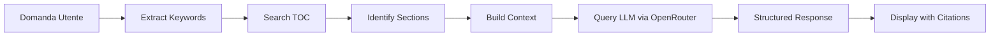

# ESC Guidelines AI Chatbot

Chatbot intelligente per interrogare le Linee Guida ESC (European Society of Cardiology) con citazioni automatiche e workflow strutturato.

## 🎯 Funzionalità

- **Ricerca Automatica nel TOC**: Il chatbot cerca automaticamente nel master TOC per identificare le sezioni rilevanti
- **Integrazione OpenRouter**: Supporta Claude 3.5 Sonnet, GPT-4, Gemini e altri modelli
- **Workflow Strutturato**: Implementa il processo Locate → Read → Cite
- **Citazioni Accurate**: Risponde sempre con riferimenti precisi a PDF, sezione e pagina
- **UI Moderna**: Interfaccia pulita stile ChatGPT con tema medico
- **Responsive**: Funziona su desktop, tablet e mobile

## 🚀 Setup

### 1. Ottieni una API Key di OpenRouter

1. Vai su [OpenRouter.ai](https://openrouter.ai/keys)
2. Crea un account
3. Genera una nuova API key
4. Copia la key (inizia con `sk-or-v1-...`)

### 2. Apri il Chatbot

Visita: [https://bdeornelas.github.io/esc-chatbot/](https://bdeornelas.github.io/esc-chatbot/)

### 3. Configura l'API Key

1. Clicca su "Inserisci la tua OpenRouter API key"
2. Incolla la tua API key
3. Seleziona il modello preferito (Claude 3.5 Sonnet è raccomandato)
4. Clicca "Salva"

### 4. Inizia a Chattare!

Prova con domande tipo:
- "Si deve fare TAC se uno ha 45mm di aortic root?"
- "Quali sono i criteri ESC per stenosi aortica severa?"
- "Target pressorio per diabetico secondo ESC 2024?"

## 🏗️ Architettura

```
esc-chatbot/
├── index.html          # Pagina principale del chatbot
├── style.css           # Stili (tema medico/cardiologico)
├── app.js              # Logica chatbot + OpenRouter integration
└── README.md           # Questa guida
```

### Workflow Implementato



## 📚 Modelli Supportati

### Raccomandato
- **Claude 3.5 Sonnet** (`anthropic/claude-3.5-sonnet`) - Migliore per medical reasoning e citazioni accurate

### Alternativi
- **Claude 3 Opus** (`anthropic/claude-3-opus`) - Più preciso ma più lento
- **GPT-4 Turbo** (`openai/gpt-4-turbo`) - Buone performance generali
- **GPT-4o** (`openai/gpt-4o`) - Più veloce e economico
- **Gemini 1.5 Pro** (`google/gemini-pro-1.5`) - Ampio context window

## 🔍 Come Funziona

### Phase 1: Locate (Ricerca nel TOC)

```javascript
// Il chatbot cerca nel ESC_GUIDELINES_TOC.md
keywords = extractKeywords(question)
// es: "aortic root", "45mm", "imaging", "ct"

relevantSections = searchTOC(keywords)
// Trova: 2024_Peripheral_Arterial_Aortic.pdf, Section 9.2.2.4
```

### Phase 2: Read (Costruzione Contesto)

```javascript
// Passa al LLM:
context = {
    question: "Si deve fare TAC se...",
    tocSections: "[sezioni rilevanti del TOC]",
    systemPrompt: "[istruzioni per citazioni ESC]"
}
```

### Phase 3: Cite (Risposta Strutturata)

```javascript
response = {
    recommendation: "Class I, Level B",
    quote: "[citazione esatta]",
    clinicalContext: {
        threshold: "≥45mm",
        surveillance: "Annuale",
        imaging: "CT o RM"
    },
    source: {
        pdf: "2024_Peripheral_Arterial_Aortic.pdf",
        section: "9.2.2.4",
        page: 70
    }
}
```

## 🎨 Personalizzazione

### Modificare i Colori

Edita `style.css`:

```css
:root {
    --primary-color: #0066cc;  /* Blu principale */
    --secondary-color: #e74c3c; /* Rosso accento */
    --success-color: #27ae60;  /* Verde status */
}
```

### Aggiungere Domande di Esempio

Edita `index.html`, sezione `.example-questions`:

```html
<button class="example-btn" data-question="La tua domanda">
    <span class="example-icon">🩺</span>
    <span class="example-text">Titolo breve</span>
</button>
```

### Cambiare Modello di Default

Edita `app.js`:

```javascript
this.model = localStorage.getItem('openrouter_model') || 'anthropic/claude-3.5-sonnet';
```

## 🔒 Privacy e Sicurezza

- ✅ **API Key locale**: La tua API key è salvata solo nel localStorage del browser
- ✅ **Nessun server**: Tutte le richieste vanno direttamente a OpenRouter
- ✅ **HTTPS only**: Tutte le comunicazioni sono criptate
- ✅ **No tracking**: Nessun analytics o tracking implementato

## 📊 Costi

I costi dipendono dal modello scelto su OpenRouter:

| Modello | Input (per 1M token) | Output (per 1M token) |
|---------|---------------------|----------------------|
| Claude 3.5 Sonnet | $3.00 | $15.00 |
| Claude 3 Opus | $15.00 | $75.00 |
| GPT-4 Turbo | $10.00 | $30.00 |
| GPT-4o | $5.00 | $15.00 |
| Gemini 1.5 Pro | $3.50 | $10.50 |

**Stima per uso tipico**: ~$0.02-0.10 per domanda complessa con Claude 3.5 Sonnet

## 🐛 Troubleshooting

### Problema: "API request failed"
**Soluzione**:
- Verifica che la tua API key sia valida
- Controlla di avere credito su OpenRouter
- Verifica la connessione internet

### Problema: "No specific sections found in TOC"
**Soluzione**:
- Prova keywords più generiche
- Usa termini in inglese (es. "aortic stenosis" invece di "stenosi aortica")
- Il chatbot risponderà comunque usando le sue conoscenze ESC

### Problema: "Rate limit exceeded"
**Soluzione**:
- Aspetta qualche secondo tra le richieste
- OpenRouter ha rate limits per API key

### Problema: Risposta non accurata
**Soluzione**:
- Usa Claude 3.5 Sonnet o Claude 3 Opus (migliori per medical reasoning)
- Fai domande più specifiche
- Verifica sempre le citazioni nei PDF originali

## 🚀 Miglioramenti Futuri

- [ ] **Backend serverless** per estrarre testo dai PDF direttamente
- [ ] **RAG vero** con embeddings e vector search
- [ ] **Streaming responses** per risposta in tempo reale
- [ ] **Export conversation** in PDF/Markdown
- [ ] **Multi-language support** (EN, IT, ES, FR)
- [ ] **Comparazione guidelines** (es. ESC vs ACC/AHA)
- [ ] **Bookmark favorite responses**
- [ ] **Share conversation** con link

## 📝 Limitazioni

1. **Accesso PDF**: Il chatbot non legge direttamente i PDF, ma usa il TOC + conoscenze del modello
2. **Dipendenza dal modello**: L'accuratezza dipende dal modello LLM scelto
3. **Verifica richiesta**: Le risposte dovrebbero sempre essere verificate nei PDF ESC ufficiali
4. **Client-side only**: Richiede JavaScript abilitato nel browser

## 🤝 Contributi

Per miglioramenti o bug reports:
1. Fork il repository
2. Crea un branch feature (`git checkout -b feature/MiglioramentoFigo`)
3. Commit le modifiche (`git commit -m 'Add: feature figa'`)
4. Push al branch (`git push origin feature/MiglioramentoFigo`)
5. Apri una Pull Request

## 📄 Licenza

Questo progetto è parte del framework Ultrathink Agents ed è disponibile per uso educativo e di ricerca.

## 📞 Supporto

Per domande o problemi:
- **Repository**: [bdeornelas.github.io](https://github.com/bdeornelas/bdeornelas.github.io)
- **Email**: [contatto via GitHub]

---

**Versione**: 1.0.0
**Ultimo aggiornamento**: 2025-11-27
**Mantenuto da**: Ultrathink Agents Framework

## 🙏 Riconoscimenti

- **ESC (European Society of Cardiology)** per le linee guida ufficiali
- **OpenRouter** per l'accesso unificato ai modelli LLM
- **Anthropic, OpenAI, Google** per i modelli AI
