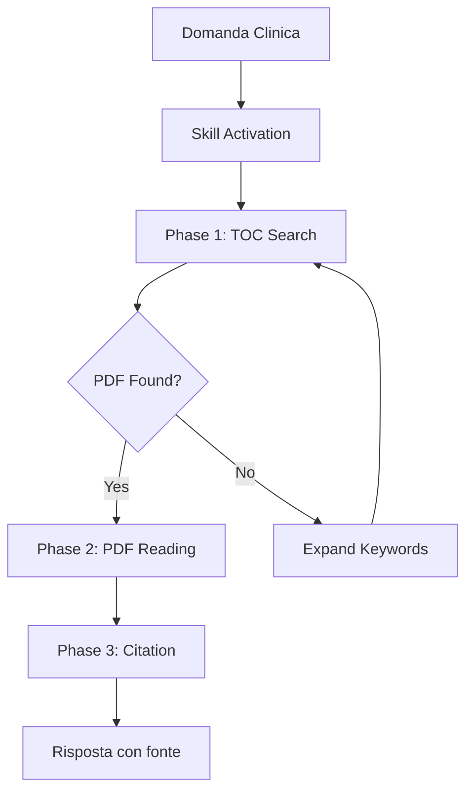

# Medical Guidelines Plugin - Quick Start

## Come Usare lo Skill ESC Guidelines Query

### Attivazione Automatica

Quando fai una domanda clinica cardiovascolare, Claude attiverà automaticamente lo skill `esc-guidelines-query` che:

1. **Cerca nel TOC** (`ESC_GUIDELINES_TOC.md`) per identificare il PDF corretto
2. **Legge il PDF** identificato nelle sezioni rilevanti
3. **Estrae la risposta** citando esattamente dalle linee guida ESC

### Esempi di Domande

#### Esempio 1: Imaging e Sorveglianza
```
Tu: "Si deve fare TAC se uno ha 45mm di aortic root?"

Claude:
1. Cerca nel TOC: "aortic root", "imaging", "CT", "45mm"
2. Identifica: 2024_Peripheral_Arterial_Aortic.pdf, Sezione 9.2.2.4
3. Legge il PDF e risponde:

"**ESC Recommendation [Class I, Level B]**:
La sorveglianza con TC o RM è raccomandata quando il diametro
della radice aortica raggiunge ≥45mm.

'Surveillance imaging with CT or MRI is recommended when the
aortic root diameter reaches 45mm or greater, with annual
follow-up for diameters 45-49mm.'

**Source**: 2024_Peripheral_Arterial_Aortic.pdf - Section 9.2.2.4
Surveillance (p. 70)"
```

#### Esempio 2: Criteri Diagnostici
```
Tu: "Quali sono i criteri ESC per stenosi aortica severa?"

Claude:
1. Cerca nel TOC: "aortic stenosis", "severe", "criteria", "diagnostic"
2. Identifica: 2022_Valvular_Heart_Disease.pdf
3. Legge il PDF e risponde con criteri ecocardiografici esatti
```

#### Esempio 3: Soglie Chirurgiche
```
Tu: "A che diametro si opera l'aneurisma dell'aorta ascendente?"

Claude:
1. Cerca nel TOC: "ascending aorta", "aneurysm", "surgery", "threshold"
2. Identifica: 2024_Peripheral_Arterial_Aortic.pdf, Sezione 9.2.5.1
3. Legge il PDF e risponde con tabella delle soglie per diverse condizioni
```

#### Esempio 4: Gestione Farmacologica
```
Tu: "Quale target pressorio ESC per paziente diabetico?"

Claude:
1. Cerca nel TOC: "hypertension", "diabetes", "target", "blood pressure"
2. Identifica: 2024_Hypertension.pdf + 2023_CVD_Diabetes.pdf
3. Legge entrambi i PDF e risponde con target specifici
```

#### Esempio 5: Anticoagulazione
```
Tu: "Quando iniziare anticoagulante in fibrillazione atriale?"

Claude:
1. Cerca nel TOC: "atrial fibrillation", "anticoagulation", "CHA2DS2-VASc"
2. Identifica: 2024_Atrial_Fibrillation.pdf, Sezione 6.1
3. Legge il PDF e risponde con score e raccomandazioni
```

## Workflow Dettagliato



### Phase 1: TOC Search (Locate)
```bash
# Claude esegue internamente:
Grep pattern: "aortic root|radice aortica|imaging|CT|TAC"
File: ESC_GUIDELINES_TOC.md
Output mode: content with context

# Risultato:
PDF: 2024_Peripheral_Arterial_Aortic.pdf
Sections: 5.4.6 (p. 29), 9.2.2.4 (p. 70)
```

### Phase 2: PDF Reading (Extract)
```bash
# Claude esegue internamente:
Read: references/esc-guidelines/2024_Peripheral_Arterial_Aortic.pdf

# Focus su:
- Recommendation boxes
- Tables con thresholds
- Diagnostic criteria
- Follow-up schedules
```

### Phase 3: Citation (Synthesize)
```markdown
# Claude fornisce:
1. Risposta diretta alla domanda
2. ESC Recommendation (Class + Level)
3. Citazione esatta dal PDF
4. Fonte precisa (PDF, sezione, pagina)
5. Contesto clinico (soglie, intervalli, eccezioni)
```

## Formati di Output

### Output Standard
```markdown
# [Domanda]

## ESC Recommendation

**Class [I/IIa/IIb/III], Level [A/B/C]**: [Sintesi]

"[Citazione esatta dal PDF]"

## Clinical Context
- Threshold: [valore]
- Imaging: [modalità]
- Surveillance: [intervallo]

## Source
**PDF**: [filename.pdf](path)
**Section**: [numero e titolo]
**Pages**: [numeri]
```

### Output con Tabella Comparativa
```markdown
# [Domanda comparativa]

| Condizione | Raccomandazione | Classe | Livello |
|------------|-----------------|--------|---------|
| Generale   | ≥55mm          | I      | B       |
| BAV        | ≥50mm          | I      | B       |
| Marfan     | ≥50mm          | I      | C       |

## Source
[Come sopra]
```

## Keywords Utili per Trigger

### Domande su Imaging
- "Quando fare TC/RM/eco?"
- "Quale imaging per [condizione]?"
- "Come sorvegliare [patologia]?"

### Domande su Soglie
- "A che diametro/valore [azione]?"
- "Quali criteri per [diagnosi]?"
- "Quando operare/trattare?"

### Domande su Terapia
- "Quale farmaco ESC raccomanda?"
- "Target pressorio/glicemico/lipidico?"
- "Quando iniziare [trattamento]?"

### Domande su Follow-up
- "Ogni quanto controllo?"
- "Quale sorveglianza per [condizione]?"
- "Quando ripetere esami?"

## Linee Guida Disponibili

### 2024
- ✅ Atrial Fibrillation
- ✅ Chronic Coronary Syndromes
- ✅ Hypertension
- ✅ Peripheral Arterial & Aortic Diseases

### 2023
- ✅ Acute Coronary Syndromes
- ✅ Cardiomyopathies
- ✅ Cardiovascular Disease & Diabetes
- ✅ Endocarditis

### 2022
- ✅ Cardio-oncology
- ✅ Valvular Heart Disease
- ✅ Pulmonary Hypertension
- ✅ Ventricular Arrhythmias

### 2021-2020
- ✅ Heart Failure (2021)
- ✅ Pacing & CRT (2021)
- ✅ Prevention (2021)
- ✅ Adult Congenital Heart Disease (2020)
- ✅ Sports Cardiology (2020)

## Best Practices per le Domande

### ✅ Domande Efficaci
- "Quando fare TAC per aortic root di 45mm?" (specifica)
- "Criteri ESC per stenosi aortica severa?" (chiara)
- "Target pressorio diabetico secondo ESC 2024?" (precisa)

### ❌ Domande Meno Efficaci
- "Dimmi tutto sull'aorta" (troppo generica)
- "Come si cura il cuore?" (non specifica)
- "Cosa dice ESC?" (manca il contesto)

## Limitazioni

1. **Solo ESC Guidelines**: Non include altre società (ACC/AHA, ESH, ecc.)
2. **PDF-based**: Richiede che il PDF sia presente in `references/esc-guidelines/`
3. **Clinical context**: Fornisce linee guida, non sostituisce giudizio clinico
4. **Language**: Principalmente in inglese (linee guida originali), traduzione in italiano disponibile

## Troubleshooting

### Problema: "Non trovo informazioni"
**Soluzione**:
- Prova keywords alternative (inglese + italiano)
- Controlla se la guideline è disponibile (vedi lista sopra)
- Espandi la ricerca a sezioni correlate

### Problema: "Citazione non precisa"
**Soluzione**:
- Verifica che il PDF sia leggibile
- Controlla che la sezione TOC corrisponda al PDF
- Richiedi di rileggere la sezione specifica

### Problema: "Raccomandazione non aggiornata"
**Soluzione**:
- Specifica l'anno desiderato (es. "secondo ESC 2024")
- Confronta con versioni precedenti se necessario

## Contatti e Supporto

Per issues o suggerimenti:
- **Repository**: bdeornelas.github.io
- **Plugin**: plugins/medical-guidelines
- **Skill**: plugins/medical-guidelines/skills/esc-guidelines-query

---

**Version**: 1.0.0
**Last Updated**: 2025-11-27
**Maintained by**: Ultrathink Agents Framework
